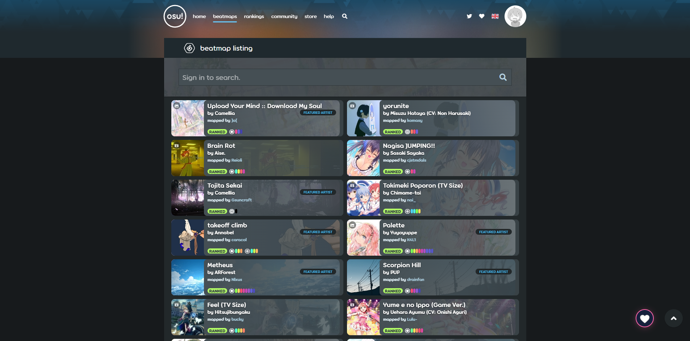
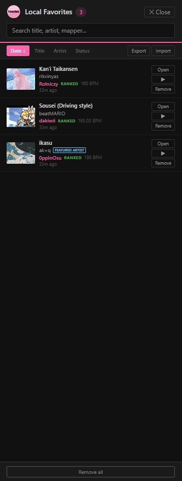
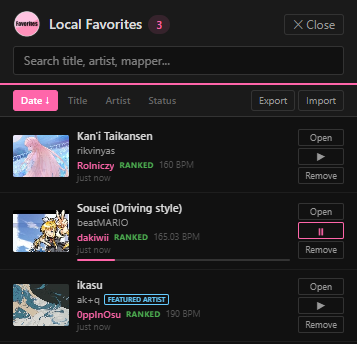

# osu! Local Favorites

Store osu! beatmap favorites locally in your browser. No server-side limits, no account needed.

## What it does

Replaces the default "Favorite" button on [osu.ppy.sh](https://osu.ppy.sh) with local browser storage. Your favorites stay on your machine.

## Demo

Here is a visual demonstration of the extension in action:

| Beatmap Detail Page & Floating Indicator | Local Favorites Side Panel |
| :---: | :---: |
|  |  |

| Beatmap Listing (With & Without Extension) | Music Previews |
| :---: | :---: |
|  |  |

*The extension also features a heart icon in the bottom-right corner of the page:*

| :---: | :---: |
|  |  |

## How to install

### Tampermonkey Userscript

1. Install [Tampermonkey](https://www.tampermonkey.net/)
2. **[Click here to install](https://github.com/vyroxat/Local-osu-Favorites/raw/main/osu-local-favorites.user.js)** — Tampermonkey will open the installation page automatically.

The script adds a **View Local Favorites** option in the Tampermonkey menu. Click it to open a side panel with all your favorites.

### [Deprecated] Extension

1. Download `osu-favorites-extension.zip` or `osu-favorites-extension.xpi` from the [last extention release](https://github.com/vyroxat/Local-osu-Favorites/releases/tag/v3.4.2)
2. Unzip
3. Go to `chrome://extensions/`, enable Developer mode
4. Click **Load unpacked** and select the unzipped folder

**For Firefox**

1. Download `osu-favorites-extension.xpi` from the [last extention release](https://github.com/vyroxat/Local-osu-Favorites/releases/tag/v3.4.2) (.xpi file)
2. To install it in Firefox go to `about:debugging` → `This Firefox` → `Load Temporary Add-on` → pick the .xpi file
   *(temporary - it will be removed after browser restart)*

**Or** clone the repo and load it directly:

```
git clone https://github.com/vyroxat/Local-osu-Favorites.git
```

Then load the folder in `chrome://extensions/`.

## How it works

- Intercepts favorite button clicks on beatmap pages and listing pages
- Blocks osu!'s server-side favorite API calls
- Stores favorites in `chrome.storage.local` (extension) or `GM_setValue` (userscript)
- Floating heart button in the bottom-right corner of beatmap pages
- Export/import as JSON

## Features

- Favorite beatmaps from detail pages or listing cards
- Search and sort favorites in the popup
- Export as JSON, import from JSON (merges, skips duplicates)
- Tracks title, artist, mapper, BPM, status, cover art, difficulty info

## Files

| File | Purpose |
|------|---------|
| `manifest.json` | Chrome MV3 manifest |
| `content.js` | Page interaction + favorite button interception |
| `interceptor.js` | Blocks osu! server API calls |
| `popup.html` | Extension popup |
| `popup.css` | Popup styles |
| `popup.js` | Popup logic |
| `background.js` | Badge counter |
| `icons/` | Extension icons |
| `osu-local-favorites.user.js` | Tampermonkey userscript |

## Limitiations

- Purely local — favorites don't sync between devices unless you export/import
- Only works on `osu.ppy.sh` beatmap pages
- May need updates if osu! changes their page layout

## License

[MIT](https://github.com/vyroxat/Local-osu-Favorites/blob/main/LICENSE)
