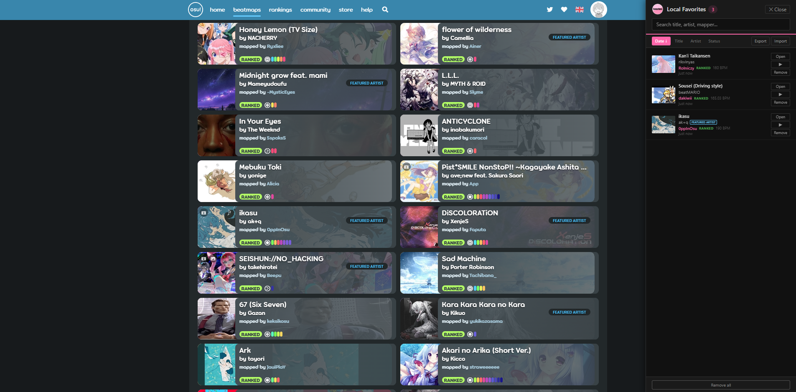
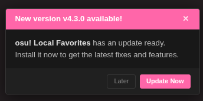
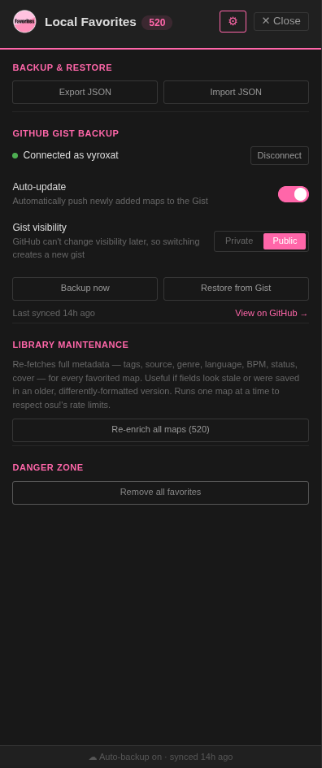

# osu! Local Favorites

Store osu! beatmap favorites locally in your browser. No server-side limits, no account needed — with optional GitHub Gist backup if you want your list to follow you across devices.

## What it does

Replaces the default "Favorite" button on [osu.ppy.sh](https://osu.ppy.sh) with local browser storage. Your favorites stay on your machine (or your own private Gist, if you choose to back them up).

## How to install

### Tampermonkey Userscript

1. Install [Tampermonkey](https://www.tampermonkey.net/)
2. **[Click here to install](https://github.com/vyroxat/Local-osu-Favorites/raw/main/osu-local-favorites.user.js)** — Tampermonkey will open the installation page automatically.

The script adds a **View Local Favorites** option in the Tampermonkey menu. Click it to open a side panel with all your favorites.

### [Deprecated] Extension

1. Download `osu-favorites-extension.zip` or `osu-favorites-extension.xpi` from the [last extension release](https://github.com/vyroxat/Local-osu-Favorites/releases/tag/v3.4.2)
2. Unzip
3. Go to `chrome://extensions/`, enable Developer mode
4. Click **Load unpacked** and select the unzipped folder

**For Firefox**

1. Download `osu-favorites-extension.xpi` from the [last extension release](https://github.com/vyroxat/Local-osu-Favorites/releases/tag/v3.4.2) (.xpi file)
2. To install it in Firefox go to `about:debugging` → `This Firefox` → `Load Temporary Add-on` → pick the .xpi file
   *(temporary - it will be removed after browser restart)*

**Or** clone the repo and load it directly:

```
git clone https://github.com/vyroxat/Local-osu-Favorites.git
```

Then load the folder in `chrome://extensions/`.

> The old browser-extension build (`manifest.json`, `content.js`, `popup.*`, `background.js`, etc.) is no longer maintained or included in this repository — only the archived v3.4.2 release above still has those files. All active development happens on the Tampermonkey userscript.


## Demo

Here is a visual demonstration of the extension in action:

| Extension button on beatmap page | When clicked it opens Favorites Side Panel |
| :---: | :---: |
|  |  |

## Beatmap Page (WITH SIDE PANEL)



| Beatmap Listing (With & Without Extension) | Music Previews |
| :---: | :---: |
|  |  |

## If you go onto a beatmap that is favorited you will see the heart icon has changed its color

| Normally | On a favorited beatmap |
| :---: | :---: |
|  |  |

## How it works

- Intercepts favorite button clicks on beatmap pages and listing pages
- Blocks osu!'s server-side favorite API calls (and the login redirect they'd otherwise trigger)
- Stores favorites locally via `GM_setValue`/`GM_getValue`, with an optional encrypted-in-transit backup to a GitHub Gist
- Floating heart button in the bottom-right corner of every osu! page
- A side panel (☰ from the floating heart, or **View Local Favorites** in the Tampermonkey menu) to browse, search, sort, play previews, download, and manage everything
- Periodically checks GitHub for a newer script version and shows an in-panel prompt when one's available



*Example screenshot — the version number and exact wording will reflect whatever the actual latest release is, not necessarily what's shown here.*

## Features

- Favorite beatmaps from detail pages or listing cards, without needing to sign in
- Search and sort favorites in the side panel (by date added, title, artist, or status)
- Inline audio previews with a progress bar, right on each card
- One-click **Open** and **Download** per map, alongside **Remove**
- Guest download links unlocked on beatmap pages and listing cards (with & without video)
- Bulk-import your real osu! account favorites via the "Favorite all" button on a profile page

### Settings

Everything below lives behind the ⚙ **Settings** button in the side panel header:



- **Backup & Restore** — export your whole library to a JSON file, or import one back in (merges, skips duplicates)
- **GitHub Gist Backup** — connect a GitHub account (personal access token, `gist` scope) and back your favorites up to a Gist:
  - **Manual or Auto** — flip a switch to have every new/removed favorite pushed automatically, or trigger backups yourself with **Backup now**
  - **Private or Public** — choose the Gist's visibility (GitHub doesn't allow changing this after creation, so switching creates a fresh Gist)
  - **Restore from Gist** — pull a backup down on a new device/browser; reconnecting also auto-detects an existing backup Gist so you don't end up with duplicates
  - A small status line in the panel footer always shows whether you're connected and when you last synced
- **Library Maintenance** — a **Re-enrich all maps** button that re-fetches full metadata (tags, source, genre, language, BPM, status, cover) for every favorite from osu! itself. Useful after a data-format change, or if some fields look stale or were saved in an older/differently-cased format. Runs one map at a time (rate-limited) with a live progress bar, and can be cancelled mid-run
- **Danger Zone** — remove all favorites, with a two-click confirmation

## Files

| File | Purpose |
|------|---------|
| `osu-local-favorites.user.js` | The Tampermonkey userscript — this *is* the extension |
| `icons/` | Icons used in the panel header and browser toolbar |
| `screenshots/` | Images used in this README |
| `LICENSE` | MIT license |

## Limitations

- Purely local by default — favorites don't sync between devices unless you export/import or connect GitHub Gist backup
- Gist backup requires a GitHub personal access token with `gist` scope, stored locally by Tampermonkey — treat it like any other credential
- Only works on `osu.ppy.sh` beatmap pages
- May need updates if osu! changes their page layout

## License

[MIT](https://github.com/vyroxat/Local-osu-Favorites/blob/main/LICENSE)
